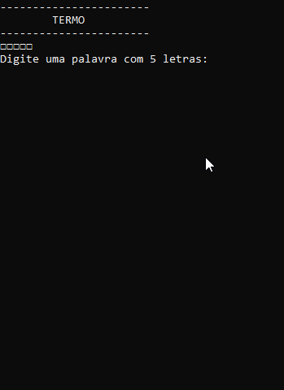

# Jogo Termo



## Projeto

Desenvolvido durante o curso Fullstack da [Academia do Programador](https://www.academiadoprogramador.net) 2026

## Introdução

O computador escolherá, de maneira aleatória, uma palavra com 5 letras entre várias possibilidades, e o jogador deve chutar a palavra inteira até adivinhá-la.

Ao jogadore é solicitado inserir a tentiva de palavra através do console e o programa indicará mediante coloração as seguintes condições das letras da palavra tentada:

- **Letra Verde:** A letra existe e está exatamente na posição da palavra secreta;

- **Letra Amarela:** A letra existe mas está na posição errada em relação a palavra secreta;

- **Letra Vermelha:** A letra não existe na palavra secreta;

Se o jogador acertar a palavra secreta em até 5 tentativas, o jogador vence, após a quinta tentativa o jogador é derrotado.

## Funcionalidades

- **Escolha de Palavra Secreta**: Uma palavra é escolhida aleatoriamente no início de cada jogo.
- **Feedback Visual**: As letras corretamente adivinhadas e posicionadas são exibidas em verde, se presentes na palavra porém em posição errada em amarelo e se não existirem na palavra em vermelho.
- **Contagem de Erros**: O jogo acompanha o número de erros cometidos pelo jogador e termina quando o máximo permitido é alcançado.

## Como utilizar o programa

1. Clone o repositório ou baixe o código comprimido em .zip.
2. Abra o emulador de terminal e navegue até a pasta raiz.
3. Utilize o comando abaixo para restaurar as dependências do projeto.

   ```
   dotnet restore
   ```

4. Em seguida compile e execute o projeto com o comando:

   ```
   dotnet run --project Termo.ConsoleApp
   ```

## Requisitos

- .NET SDK 10.0